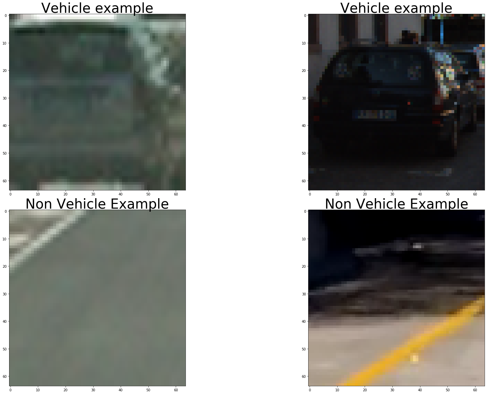
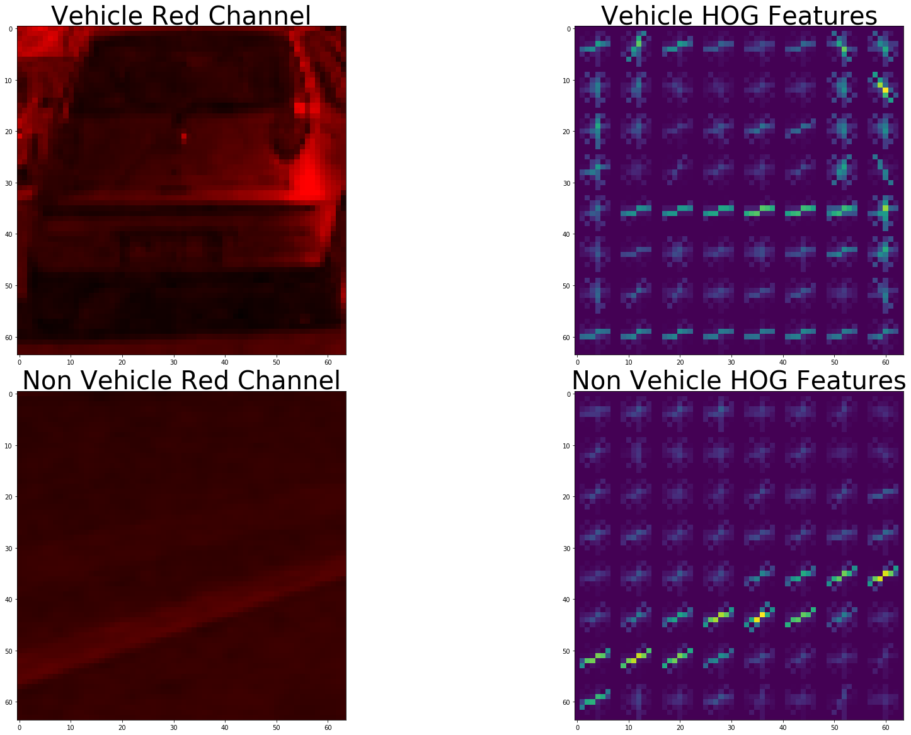
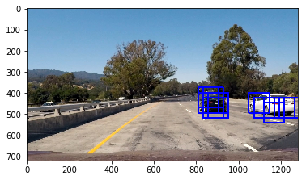
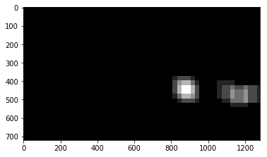
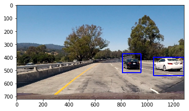

## Vehicle Detection Project

The purpose of this project is to create a pipeline which can detect vehicles in a video stream and draw bounding boxes around those vehicles.

### Dataset for training and testing of SVM Classifier

The core of this object detection pipeline is the SVM classifer that takes images and classifies them as 'car' or 'not car'. The classifier used here is an implementation of a SVM trained on example images with cars and example images without cars. These images are taken from the GTI and KITTI datasets. The code in the analagous section of my [vehicle_detection.ipynb](vehicle_detection.ipynb) creates two lists. One list with paths to images of cars, and another list with paths to images without cars. Two example images from each list are shown below:

### Utility functions from Vehicle Detection and Tracking Lesson

Many useful functions for computing HOG features, spatial features, histogram features, image segmentation, and drawing boxes were provided in the course material for the Vehicle Detection and Tracking lesson. The provided functions which I used for this project can be found in the analagous section of [vehicle_detection.ipynb](vehicle_detection.ipynb)

### Feature selection for SVM Classifier

After trying many different combinations and sizes of feature vectors, I settled on the following parameters for the definition of the feature vectors:
* color_space = 'RGB'
* orient = 9
* pix_per_cell = 8
* cell_per_block = 2
* hog_channel = 0
* spatial_size = (16, 16)
* hist_bins = 16
* spatial_feat = True
* hist_feat = False
* hog_feat = True

These parameters gave me a good balance between training/inference time and classification accuracy. Additionally, with these parameters I observed a very low false negative rate, at the consequence of more false positives than for some other combinations of feature parameters. However, in the heatmap step of this pipeline, I can more easily filter out the false positives than false negatives. 
With these parameters, I utilize HOG features and spatial features. The spatial features are simply a downsampled version of the original image while HOG, or Histogram of Oriented Gradients, features retain information about the shapes present in the image. Below I show the red channel for example images as well as plots of the HOG features:

### Training the SVM Classifier

After selection of the feature parameters, the feature vectors are generated, scaled, and used to train the SVM classifier. Normally, I would randomize the placement of positive and negative examples into the training and test sets, but, with this particular dataset, there were many images which were captured from continuous video streams, so they are very similar (in particular, the positive examples from the GTI dataset). To prevent images which are nearly identical from being placed in the training and test sets, I manually segemented the data to avoid this. With a feature vector length of 2532, it took me 11.85 seconds to train my SVM Classifier to a test accuracy of 0.9713

### Image segmentation and segment classification using sliding windows

With the trained SVM classifier, I can now perform inference on images to determine if they contain a vehicle. First, I defined a region of interest within the frame. I only search for vehicles within this region of interest. By doing such, I reduce false positives and reduce the time it takes for my pipeline to process a frame. Next, I extract sections of the region of interest and resize those sections to 64x64 so that I can generate feature vectors which are the same length as those used to train my classifier. After scaling the generated feature vectors, I can pass them to my classifier to determine if there is a vehicle in this image segment. I used a sliding window approach to segment the region of interest and I experimented with different overlap percentages, segment widths/heights, and even multiple sizes of segments. I found that using smaller windows in addition to the bigger windows to try and capture near and far vehicle perspectives did not work very well and the small windows in particular took a lot of time to process. In the end, I chose a single 96x96 window size and 75% overlap. An example with overlapping postive image segments is shown below:

### Vehicle Tracking with a heatmap

To turn the raw vehicle detections into reliable tracks, I use a heat map. For every image segment where a vehicle is detected, I add heat using the functions provided in the lesson.

When a vehicle is present in a section of the frame, multiple image segements are classified as part of that vehicle due to the overlap and size of the vehicle in the image. A threshold is then applied to the heatmap and the output from the label function from scipy is used to generate bounding boxes for the hot areas. The heat map for the above frame is shown in the below image: 

All that remains is to update the heatmap on a frame-by-frame basis and drawing the bounding boxes for the hot areas on the original frame:

Here are the results for each of the test frames:

The final output video is [here](output.mp4)

### Discussion

For me, the most challenging part of this project was selecting the right parameters for the generation of the feature vector used by the SVM classifier. This took me a lot of trial and error and was a very manual process. A better approach would be to apply sklearn's GridSearchCV to search combinations of parameters. However, the classifier with the highest accuracy wasn't the best one to use for the pipeline as I found that it seemed to generate more false positives than the one that I ended up using. Some limitations of this approach are that we do not use images of oncoming cars to train the classifer, so it would likely have poor performace on oncoming traffic. Also, the heatmap implementaion performs best then the detected vehicle has a static location in the frame or moves very slowly in the frame. A fast moving vehicle would not build heat at the same pixels and would be harder to detect using this method.
